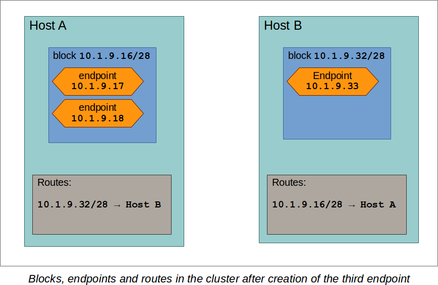
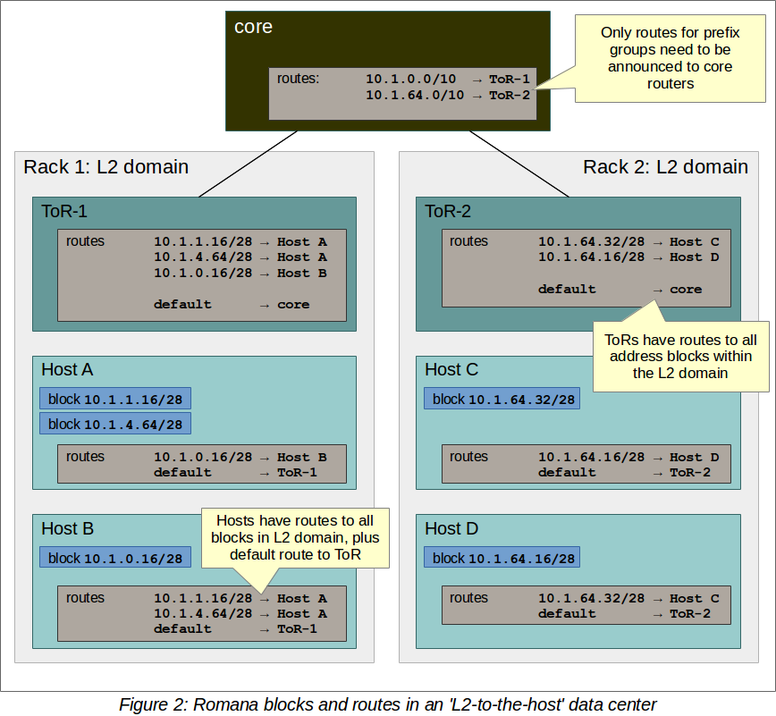
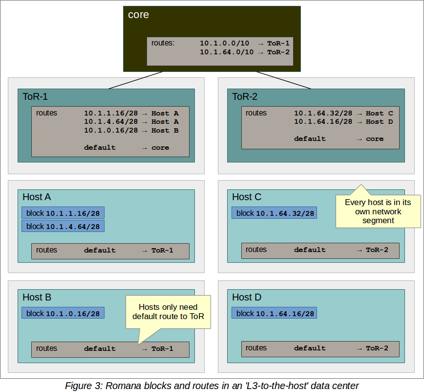

# Romana core concepts

This document explains some of Romana's core concepts. Oftentimes, a detailed
understanding of those is not required, since Romana strives to provide
sensible defaults and working out-of-the-box configurations. But for custom
deployments or advanced configuration, having an understanding of those
concepts is helpful.

## Terminology

The following terminology is used throughout this document:

* _agent_: This is a Romana component, which runs on every node in a cluster.
  The 'Romana agent' is used to configure interfaces, routing or network
  policies on that host.

* _CIDR_: 'Classless Inter-Domain Routing'. We use the term CIDR to refer
  specifically to the 'CIDR notation', which is a compact representation of an
  IP address and routing prefix. Most commonly, however, we use this notation
  to describe ranges of addresses. For example, the CIDR of `10.1.0.0/16`
  describes all IP addresses from `10.1.0.0` to `10.1.255.255`.

* _Clos network_: A Clos network is a hierarchical
  [network topology](#term_topology) often used for data center networks. It
  can be described as a tree-like 'spine and leaf' architecture, with racks of
  servers as the bottom layer. Those servers are typically connected to a ToR
  ('top of rack') switch or router, which represents the next layer. An entire
  rack (servers plus ToR) may be considered a 'leaf' in this architecture. Core
  routers or switches are then used to connect those ToRs, often in a highly
  redundant manner, which can tolerate failure of core devices. Those core
  devices then form the 'spine' in the architecture. This is a
  simplified description and countless variations of Clos networks exist. For
  example, additional layers may be inserted. Or in various large core
  networks, and entire spine may be considered the 'leaf', depending on the
  scope of the discussion and network. Connections between spines and leafs may
  be managed by vendor specific network fabric implementation, and so on.

* _endpoint_: Romana deals with the provisioning of networking for
  [workloads](#term_workload) in clusters (VMs for OpenStack, pods for
  Kubernetes). Due to a network-centric view, for Romana the most important
  aspect of a workload is the 'network endpoint', which is the IP address and
  network interface of the workload.

* _host_: In this context, usually a server computer that is part of a cluster,
  such as OpenStack or Kubernetes. In this document we will often use the term
  'host' or 'node' interchangeably.

* _IPAM_: 'IP Address Manager'. A service that manages IP addresses in a
  network. If anyone in the network needs a new address, a request can be sent
  to IPAM to get 'the next' available IP address from some pre configured
  range. Our specialized IPAM is an extremely important component for Romana,
  since carefully chosen addresses and network prefixes are used to greatly
  [collapse routes](#term_aggregation) and reduce the impact on hosts and
  networking equipment.

* _master node_: One of the [nodes](#term_node) of an OpenStack or Kubernetes
  cluster, which fulfills 'master' or 'controller' functions. This is typically
  where central components of the cluster infrastructure are run.
  [Workloads](#term_workload) (VMs or pods) may or may not be run on master
  nodes, depending on configuration.

* _node_: A host that is a member of a cluster (either OpenStack or
  Kubernetes). In this document we will often use the term 'host' or 'node'
  interchangeably.

* _policy_: Romana provides network policies to manage network traffic and
  allow or deny access. You can always use the Romana CLI and API to define
  policies. For Kubernetes clusters, Romana also implements a direct and
  automatic mapping of Kubernetes policies to Romana policies.

* _route aggregation_: Since all [endpoint](#term_endpoint) IP addresses are fully routable,
  Romana needs to configure and manage the routes within the network. Great
  emphasis has been placed on collapsing those routes (aggregation), so that
  in the end only very few routes actually need to be configured in the network
  infrastructure, while still providing full connectivity for all
  [endpoints](#term_endpoint). For example, if there are two routes to adjacent
  [CIDRs](#term_cidr) `10.1.0.0/25` and `10.1.0.128/25`, which point to the
  same target then this can be collapsed into a single route for the CIDR
  `10.1.0.0/24`. Romana facilitates a special [IPAM](#term_ipam) that is aware
  of network topology in order to assign IP addresses to endpoints in a manner
  that makes it easy to automatically aggregate routes.

* _topology_: A network topology describes the layout of components in a
  network. How are hosts, switches and routers connected? How can two
  components communicate? Who can reach whom directly and who needs to forward
  packets on behalf of others? Traditional network topologies are 'bus',
  'star', 'ring' or 'mesh'. In modern data centers topologies can be complex
  and may contain some mixture of those types, often adding certain tree-like
  hierarchical aspects to the topology, for example in
  [Clos networks](#term_clos).

* _workload_: In OpenStack clusters this is typically a VM, while in Kubernetes
  clusters this is normally a pod. These workloads run on the cluster
  [hosts](#term_host). Each workload is represented by a network
  [endpoint](#term_endpoint), consisting of a network interface that is
  configured on the host as well as an assigned IP address.

## Networking

* [Fully routed networking](#fully-routed-networks-no-overlays)
* [Address blocks](#romana-address-blocks)
* [Route management](#route-management)

### Fully routed networks, no overlays

Romana does not use network overlays or tunnels. Instead,
[_endpoints_](#term_endpoint) (VMs for OpenStack, pods for Kubernetes) get
real, routable IP addresses, which are configured on cluster
[hosts](#term_host). To ensure connectivity between endpoints, Romana manages
routes on cluster hosts as well as network equipment or in the cloud
infrastructure, as needed.

Using real, routable IP addresses has multiple advantages:

* Performance: Traffic is forwarded and processed by hosts and network
  equipment at full speed, no cycles are spent on encapsulating packets.
* Scalability: Native, routed IP networking offers tremendous scalability, as
  demonstrated by the Internet itself. Romana's use of routed IP addressing for
  endpoints means that no time, CPU or memory intensive tunnels or other
  encapsulation needs to be managed or maintained and that network equipment
  can run at optimal efficiency.
* Visibility: Packet traces show the real IP addresses, allowing for easier
  trouble shooting and traffic management.

### Romana address blocks

To increase scalability and reduce resource requirements, Romana allocates
[endpoint](#term_endpoint) addresses not individually, but in blocks of
addresses. Each block can be expressed in the form of a [CIDR](#term_cidr). For
example, a typical address block may have 4 bits (a `/28` CIDR), and therefore
could contain up to 16 different IP addresses.
[Routing is managed](#route-management) based on those blocks. Only one network
route is required for all addresses within this block. Therefore, address
blocks are an important contribution to [route aggregation](#term_aggregation).

Let's look at an example to illustrate:

Assume Romana has been configured to use addresses out of the `10.1.0.0/16`
address range and to use `/28` blocks. Now assume a first workload needs to be
started. The cluster scheduler decided to place this workload on host A of the
cluster.

Romana's IPAM realizes that no block is in use yet on host A, allocates a block
and 'assigns' it to host A. For example, it may choose to use block
`10.1.9.16/28`. As this assignment is made, the Romana agent on the cluster
hosts [may create routes](#route-management) to this block's address range,
which point at host A.  The address `10.1.9.17` (contained in that address
block) could be chosen by IPAM and is returned as the result of the original
address request. Therefore, the first endpoint gets address `10.1.9.17`.

Now a second endpoint needs to be brought up. The scheduler chose host B. IPAM
finds that no block is present on host B yet, chooses one (maybe
`10.1.9.32/28`) and returns an IP address from that block. For example
`10.1.9.33`.

The two endpoints (`10.1.9.17` on host A and `10.1.9.33` on host B) can
communicate with each other, because Romana automatically setup routing for
those address blocks.

If now a third endpoint needs to be brought up, and it is again scheduled to
host A, then IPAM detects that there is an address block already on host A, but
it is not fully used, yet. Therefore, it returns a free address from that
block, for example `10.1.9.18`. Importantly, no new block allocation was
necessary in that case, an no additional routes had to be configured. This
image illustrates the state at this point:

As a result, the need to update routes on hosts or in the network
infrastructure is greatly reduced. The larger the address blocks, the less
often routes have to be configured or updated.

Choosing the right address block size is a tradeoff between the number of
routes on one hand, as well as potentially wasted IP addresses on the other: If
the block size was chosen too large then some IP addresses may never be used.
For example, imagine a block size of /24. The block may contain up to 256
addresses. If on a particular host you never run that many workloads then some
of those addresses may be wasted, since they are not available on other hosts.

If a block size is chosen too small then for a cluster with many endpoints
Romana has to create a lot of routes (either on the hosts or the network
equipment). Romana provides many features to reduce the number of routes and
route updates in the network and therefore - for most cases - we recommend
address block sizes of at least 4 or 5 bits.

An address block, while in use, is tied to a specific host. When workloads are
stopped and the last address within a block is released, the block itself goes
back into Romana IPAM's free pool. When it is used the next time, it may be
allocated to a different host.

### Route management

Depending on the [network's topology](#term_topology) Romana creates and manages
routes for [address blocks](#romana-address-blocks) by a number of different
means.

In most cases, the [Romana agents](#term_agent) on the
[cluster hosts](#term_hosts) create routes to address blocks on other cluster
hosts, at least for those hosts that are on the same L2 segment. This is often
the case if the ToR acts as a switch for the hosts in the rack and is called
'L2-to-the-host'. This image illustrates the route configuration for that case:

Some networks are designed for 'L3-to-the-host', meaning that hosts do not
share an L2 segment. In that case, block routes only need to be created on the
ToR. The following image shows where routes are created in an
L3-to-the-host data center:

Different means to create routes on network equipment can be configured. For
example, BGP broadcasts.

Romana is provided with topological information about the network in which it is
deployed as a configuration parameter. It then uses this information to greatly
[collapse routes](#term_aggregation) and reduce the number of routes that need
to be created and updated. In many cases, with Romana the network
infrastructure reaches a 'steady state' with very small numbers of routes and
few if any route updates required during the life time of a cluster.

This reduces the impact on the network infrastructure and results in stable,
easily understood and comprehensible cluster operations.

## Topology

* [Prefix groups](#prefix-groups)
* [Topology map](#topology-map)

### Prefix groups

_Prefix groups_ are one of the key ideas behind Romana's [IPAM](#term_ipam).
With this concept, IP addresses for [endpoints](#term_endpoint) are chosen from
the same [CIDR](#term_cidr) if they are created in 'close proximity'.

For example, assume you run a cluster in a data center network, consisting of
multiple racks full of servers. Romana IPAM may consider all the hosts within a
rack to be part of the same prefix group. This means that all
[address blocks](#romana-address-blocks) - and therefore all endpoint IP
addresses - assigned to those hosts will share the same address prefix. This
then means that the ToRs (top of rack) switches in the data center only need to
know a single route to be able to send traffic to all the endpoints within a
rack: With this topology aware IPAM, Romana is able to drastically collapse the
routing table, reducing the memory requirements, CPU load and network load of
the network infrastructure.

Let's look at an example in more detail.

Assume your data center consists of four racks. Each rack has a ToR on top.
Those ToRs are all connected to a set of core routers.

Assume further that the overall address range for Romana is `10.1.0.0/16`.

The fact that there are four racks is expressed in the
[topology map](#topology-map), a configuration that describes the
[network topology](#term_topology) and which is provided to Romana as input.
Romana then takes this information and automatically carves up the overall CIDR
configured for Romana into four sub-ranges: `10.1.0.0/18`, `10.1.64.0/18`,
`10.1.128.0/18` and `10.1.192.0/18`. It then assigns one of those sub-ranges to
each prefix group and organizes the hosts in each rack into a prefix group. For
example, `10.1.0.0/18` may be assigned to rack 1, `10.1.64.0/18` to rack 2, and
so on.

Then, if the cluster scheduler wishes to bring up a workload on any host in
rack 1, Romana IPAM will make sure that the address block used for this
endpoint will be fully contained in the `10.1.0.0/18` CIDR. For example, the
address block may have the CIDR `10.1.0.8/28`.

Likewise, if an address block is needed on any host in rack 2, it will have a
CIDR that's contained within the second prefix group's CIDR. For example,
`10.1.64.8/28`.

As a result, to send outgoing packets to endpoints in other racks,
the core routers only need to have four routes: One route for each
prefix-group's CIDR to the ToR for that prefix-group / rack. These routes do
not even require updating during the life time of the cluster.

Please note that every environment is different. Romana provides for a great
deal of flexibility to organize hosts into prefix groups and how to configure
the announcement of routes. Prefix groups are not only important in data
centers, but also in clusters that are running on cloud infrastructure. Where
and how routes are announced and created may differ depending on the
environment. Romana supports a number of options.

### Topology map

A _topology map_ is one of the configuration parameters for Romana and is the
basis on which Romana [IPAM](#term_ipam) calculates [CIDRs](#term_cidr) for
[prefix groups](#prefix-groups). The topology map is a representation of
certain aspects of the actual [network topology](#term_topology).

Examples for a number of real world topology maps are included with the Romana
distribution. Here are a few simplified examples:

#### Example 1: Flat network, single prefix group

In this example, any host that is added to the cluster will be automatically
assigned to the single prefix group we have defined here.

    {
        ...
        "map" : [
            {
                "name"   : "all-hosts",
                "groups" : []
            }
        ]
        ...
    }

The CIDR of the prefix groups will be the entire CIDR given to Romana to work
with.

#### Example 2: Data center with four racks

Here, we define a topology with four prefix group, one for each rack in our
data center.

Note the 'assignment' specifier. This matches any tags assigned to
[cluster hosts](#term_host). Therefore, as cluster nodes are added, the
operator should ensure that tags with those values are specified for each host.
Both OpenStack as well as Kubernetes offer the option to tag hosts as they are
added to the cluster. In some cloud environments, hosts are automatically added
with a region or zone identifier, which can then be used in the same manner.

    {
        ...
        "map" : [
            {
                "name"       : "rack-1",
                "assignment" : { "my-location-tag" : "rack-1" },
                "groups"     : []
            },
            {
                "name"       : "rack-2",
                "assignment" : { "my-location-tag" : "rack-2" },
                "groups"     : []
            },
            {
                "name"       : "rack-3",
                "assignment" : { "my-location-tag" : "rack-3" },
                "groups"     : []
            },
            {
                "name"       : "rack-4",
                "assignment" : { "my-location-tag" : "rack-4" },
                "groups"     : []
            },
        ]
        ...
    }

In this example, Romana's entire address range is automatically split into four
CIDRs and each of those CIDRs is assigned to one prefix group. This means that
all [endpoints](#term_endpoint) in a given rack will share the same address
prefix, which allows for the complete aggregation of all routes for the
endpoints in that rack.

More complex group hierarchies with multiple levels can also be expressed in
topology maps.

